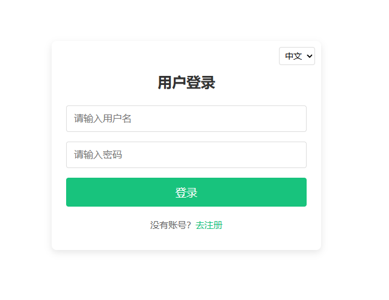
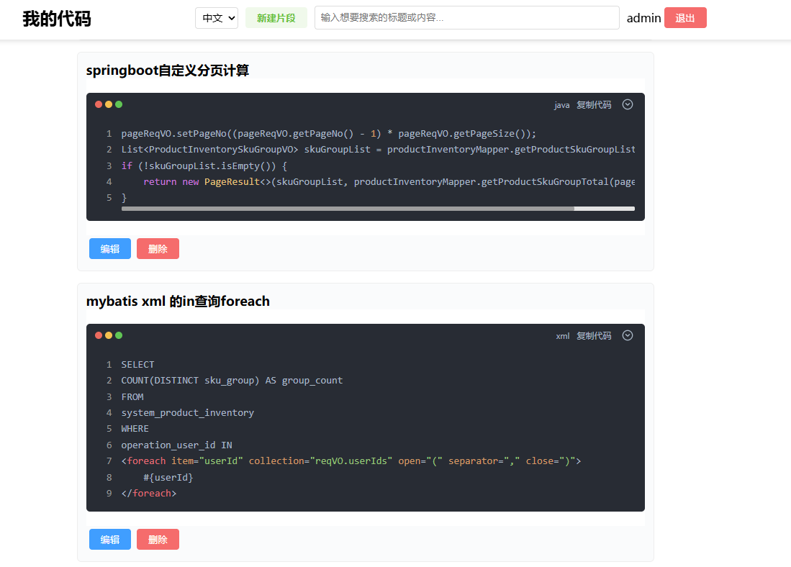
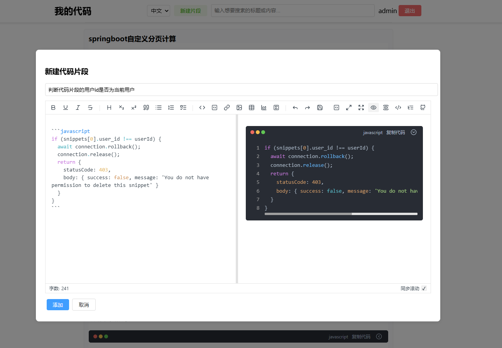

# 代码片段管理系统

这是一个基于 Nuxt 4.0 构建的代码片段管理系统，支持用户注册、登录、创建、编辑和删除代码片段，并提供中英文双语界面。

## 功能特点

- 用户认证系统（注册、登录）
- 代码片段管理（创建、编辑、删除、查看）
- Markdown 编辑器支持
- 响应式设计
- 国际化支持（中文、英文）
- 分页功能

## 技术栈

- **前端框架**: Nuxt 4.0, Vue 3.5
- **UI 组件**: 自定义 CSS
- **状态管理**: Vue 响应式 API
- **数据库**: MySQL
- **认证**: JWT (JSON Web Tokens)
- **国际化**: vue-i18n
- **Markdown 编辑器**: md-editor-v3

## 系统要求

- Node.js >= 16.0.0
- MySQL >= 5.7
- npm >= 7.0.0 或 pnpm >= 10.0.0





## 安装步骤

### 1. 克隆仓库

```bash
git clone <repository-url>
cd my-code-nuxt
```

### 2. 安装依赖

使用 npm:
```bash
npm install
```

或使用 pnpm:
```bash
pnpm install
```

### 3. 配置环境变量（仅限开发环境）

创建 `.env` 文件并添加以下配置:

```
DB_HOST=localhost
DB_USER=your_db_user
DB_PASS=your_db_password
DB_NAME=your_db_name
DB_PORT=3306
```

### 4. 创建数据库表

在 MySQL 中执行以下 SQL 语句:

```sql
CREATE DATABASE IF NOT EXISTS your_db_name;
USE your_db_name;

CREATE TABLE users (
  id INT AUTO_INCREMENT PRIMARY KEY,
  username VARCHAR(50) NOT NULL UNIQUE,
  email VARCHAR(100) NOT NULL UNIQUE,
  password VARCHAR(255) NOT NULL,
  created_at TIMESTAMP DEFAULT CURRENT_TIMESTAMP
);

CREATE TABLE snippets (
  id INT AUTO_INCREMENT PRIMARY KEY,
  user_id INT NOT NULL,
  title VARCHAR(100) NOT NULL,
  content TEXT NOT NULL,
  description TEXT,
  created_at TIMESTAMP DEFAULT CURRENT_TIMESTAMP,
  updated_at TIMESTAMP DEFAULT CURRENT_TIMESTAMP ON UPDATE CURRENT_TIMESTAMP,
  FOREIGN KEY (user_id) REFERENCES users(id) ON DELETE CASCADE
);
```

### 5. 运行开发服务器

```bash
npm run dev
```

或

```bash
pnpm dev
```

应用将在 http://localhost:3000 上运行

## 生产部署

### 1. 构建应用

```bash
npm run build
```

或

```bash
pnpm build
```

### 2. 启动生产服务器

```bash
node .output/server/index.mjs
```

或

```bash
指定端口号运行
PORT=50001 .output/server/index.mjs
```

## 国际化功能

本项目支持中英文双语界面，用户可以通过界面右上角的语言切换器切换语言。语言设置会被保存在浏览器的本地存储中，刷新页面后仍然保持用户的语言选择。

### 添加更多语言

如需添加更多语言，请按照以下步骤操作:

1. 在 `app/locales` 目录下创建新的语言文件
2. 在 `app/plugins/i18n.ts` 文件中导入新语言文件并添加到配置中
3. 在语言切换器中添加新语言选项

## 项目结构

```
my-code-nuxt/
├── app/                    # 应用目录
│   ├── locales/            # 国际化语言文件
│   ├── middleware/         # 中间件
│   ├── pages/              # 页面组件
│   └── plugins/            # 插件
├── public/                 # 静态资源
├── server/                 # 服务器端 API
│   ├── api/                # API 路由
│   └── db.ts               # 数据库连接
├── .env                    # 环境变量
├── nuxt.config.ts          # Nuxt 配置
├── package.json            # 项目依赖
└── README.md               # 项目文档
```

## 贡献指南

1. Fork 仓库
2. 创建功能分支: `git checkout -b feature/your-feature-name`
3. 提交更改: `git commit -m 'Add some feature'`
4. 推送到分支: `git push origin feature/your-feature-name`
5. 提交 Pull Request

## 许可证

MIT

---

[English Documentation](./README.en.md)